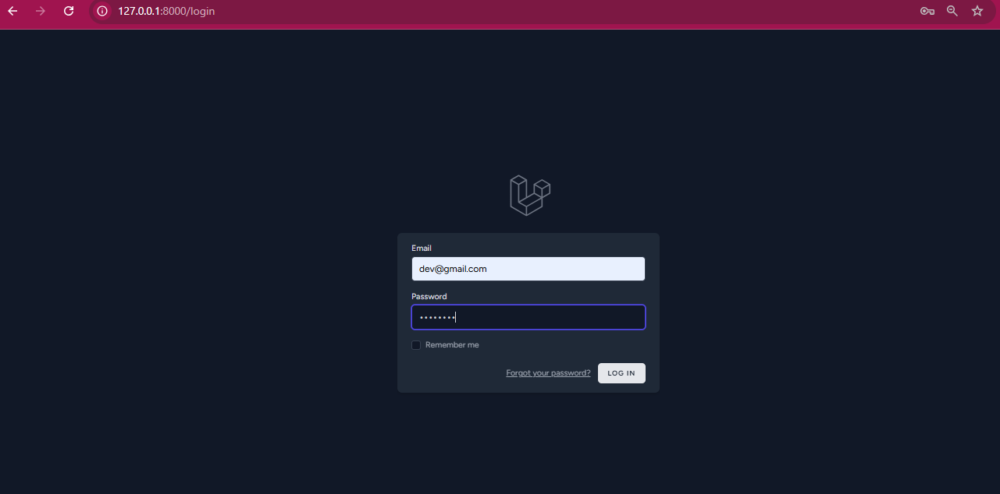
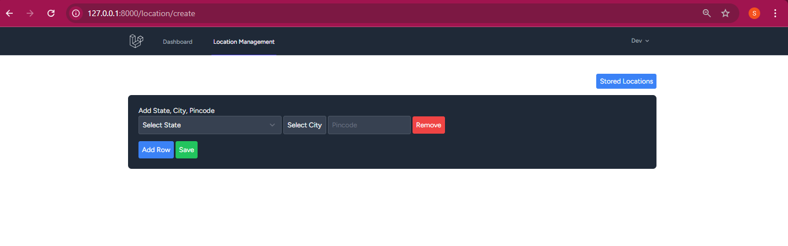
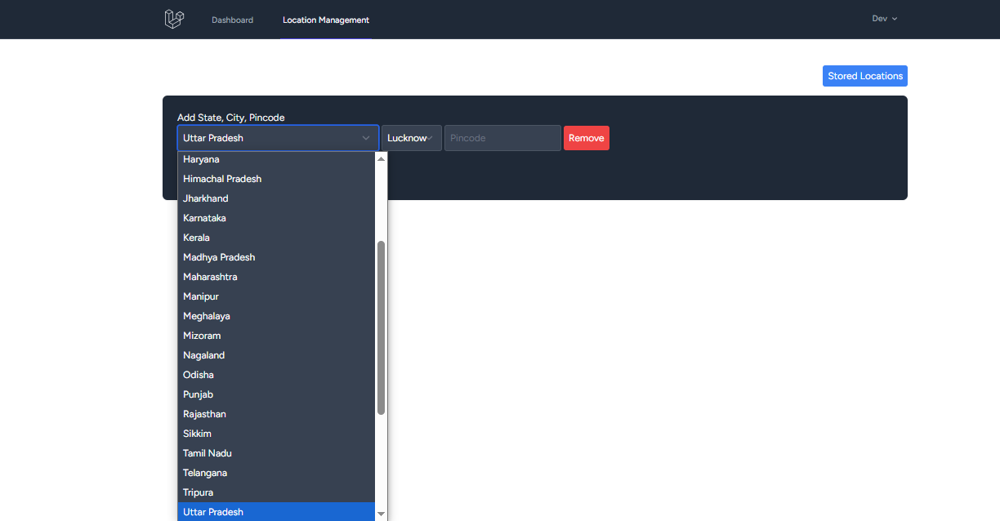
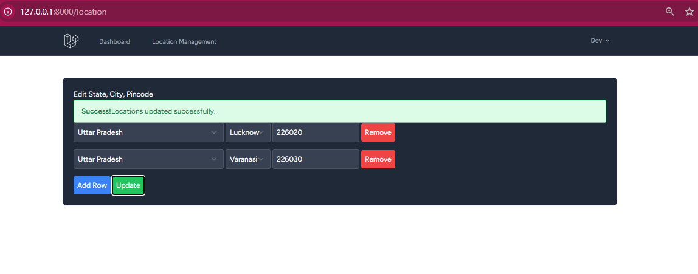
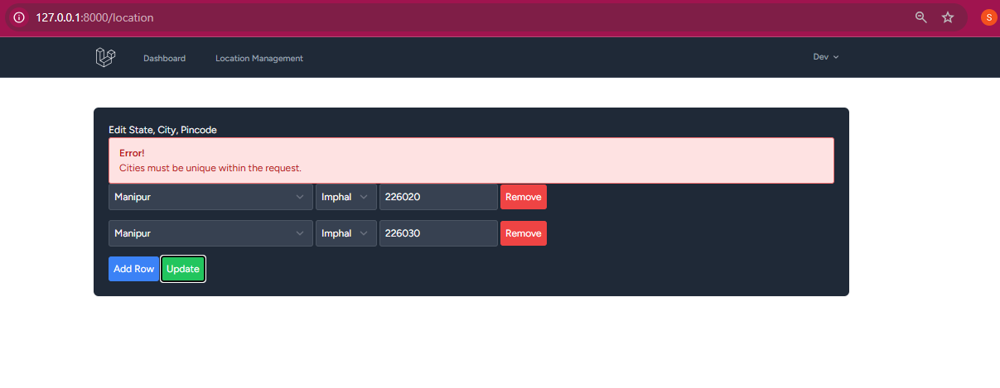
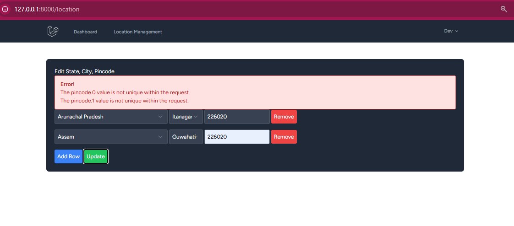
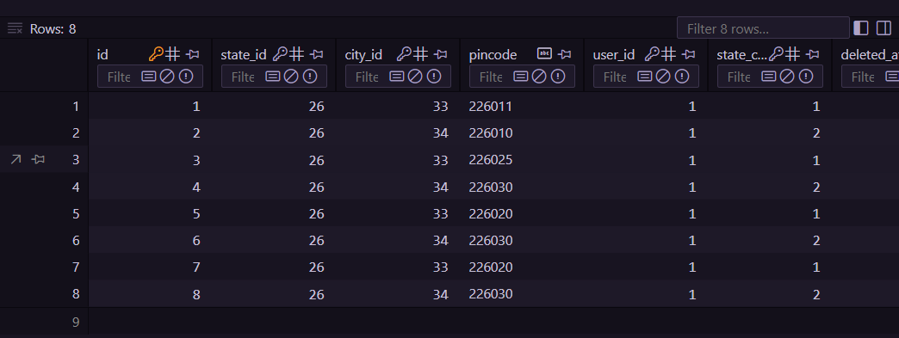

# Location Management

## Here you can manage state, city and pincode

**Please run below command to perfect UI**

> npm run dev

**To Run migration: Run Following Command**

> php artisan migrate:fresh --seed

**Dummy Username and Password are given below**

> Username: dev@gmail.com
> Password: password

**Login Page**

**Location Management** 

**Update Location**

**Update Form Validations**

**state_city_pincode_history**

